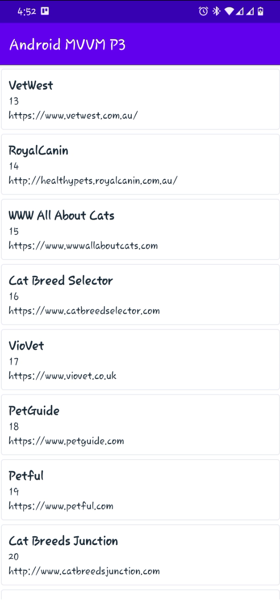

# Cats

# Android-Paging-3-with-MVVM-Retrofit-and-Flow
The repo shows details on how to use paging 3 with retrofit and LiveData/Flow. The repo also follows Mvvm architecture with Dagger Hilt

## Caching
Caching with Room was added

## Screenshot
||
|:----:|

## Technical Specs

- **Architectural pattern**- [MVVM with Clean Architecture](https://developer.android.com/courses/pathways/android-architecture "MVVM with Clean Architecture")
- **Software Design Philosophy** - Solid Principle and Clean Code Architecture
- **Dependency Injections** - [Dagger-Hilt](https://developer.android.com/training/dependency-injection/hilt-android "Dagger-Hilt")
- **Background Threading** - Coroutines with Lifecycle components
- **State Handling** - UI State, StateFlow, Flow
- **Network Call** - [Retrofit2](https://square.github.io/retrofit/ "Retrofit2")
- **Data Serialization** - [GSON](https://github.com/google/gson "GSON")
- **Database & Storage** - Firebase Realtime DB, Firebase Storage
- **API** - [CATS API]("https://documenter.getpostman.com/view/5578104/RWgqUxxh")
- **Third Party Libraries** -
